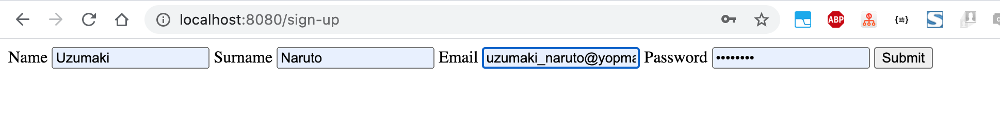

# springboot-user-registration
## Things todo list
1. Clone this repository: `git clone https://github.com/hendisantika/springboot-user-registration.git`
2. Go insidet the folder: `cd springboot-user-registration`
3. Run the application: `mvn clean spring-boot:run`
4. Open your favorite browser: http://localhost:8080/sign-up

## Images Screen shot

Sign Up Page

Yopmail Page

Yopmail Inbox Page

Login Page

Welcome Page

